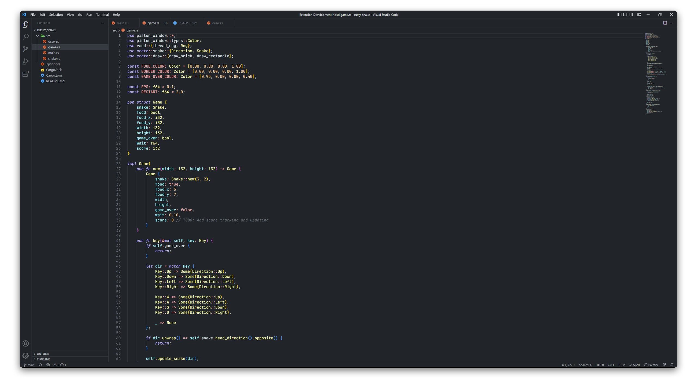

<div align="center">


# Seabrook

An _aesthetically pleasing_ theme for Visual Studio Code.

<a href="https://vscode.dev/theme/sortbyfirstname.seabrook/Seabrook%20Dark">
    
</a>


<br />

## __Light mode coming soon!__

<br />

</div>

### Seabrook Dark 



---

## Disabling italics
If you would like to disable italics, you can add the following to your [settings.json](https://code.visualstudio.com/docs/getstarted/settings#_settings-file-locations) file:
```json
"editor.tokenColorCustomizations": {
        "[Seabrook Dark]": {
            "textMateRules": [{
                "scope": [
                    "comment",
                    "invalid",
                    "keyword",
                    "entity.other.attribute-name"
                ],
                "settings": {
                    "fontStyle": ""
                }
            }]
        }
    }
```